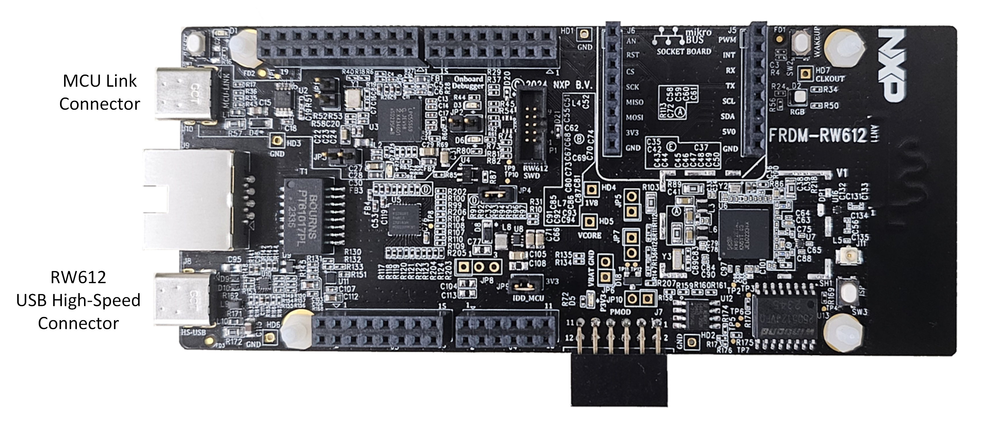
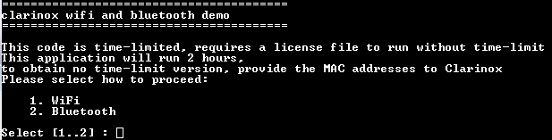
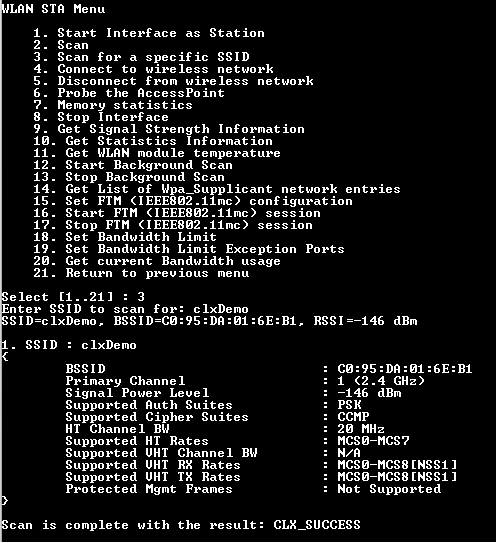
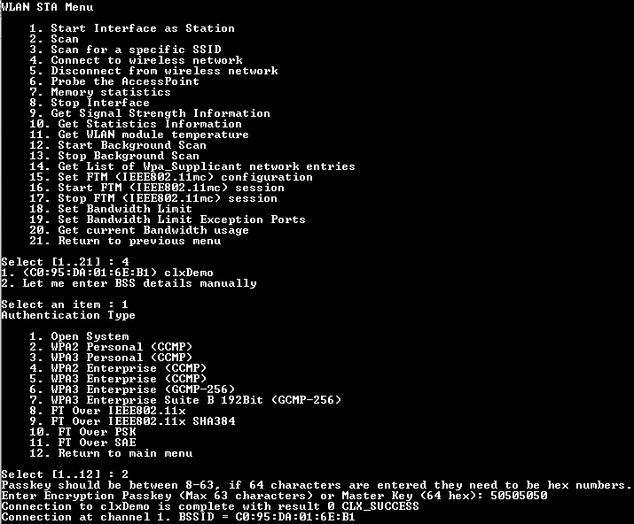
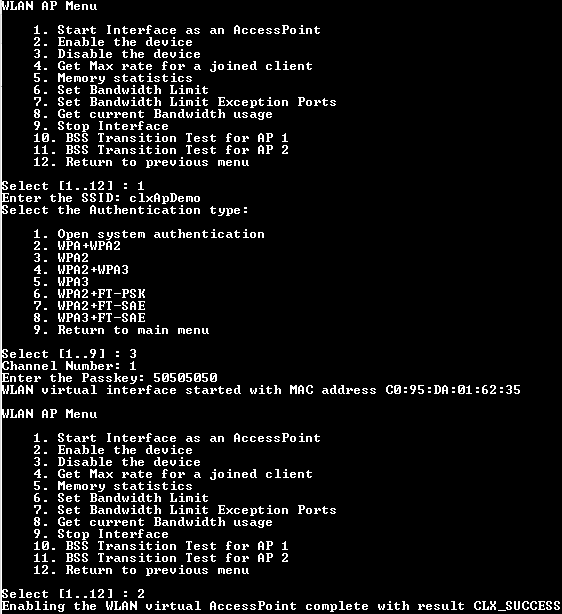
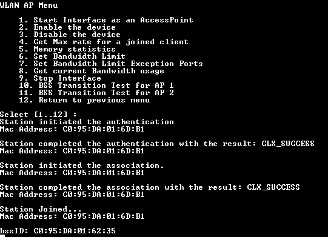
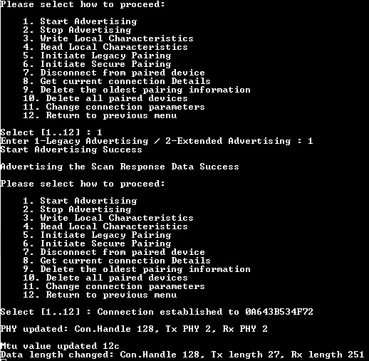
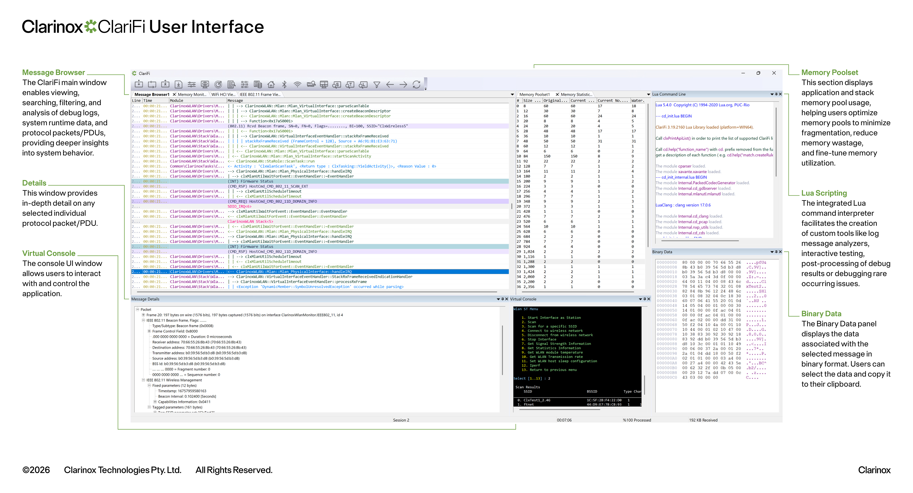

# Clarinox - NXP Application Code Hub

 
## Clarinox Bluetooth Low Energy and WiFi AP and Station simultaneous operation demonstration using IAR toolchain on RW612

This software demonstrates simultaneous Clarinox Bluetooth Low Energy and Wi-Fi stack operation using the IAR toolchain on RW612. Running on the FRDM-RW612 board with FreeRTOS, a single device operates as a Wi-Fi Access Point and a Wi-Fi Station concurrently, while also running a BLE application that supports both Central and Peripheral roles.

#### Boards: FRDM-RW612
#### Categories: Wireless Connectivity
#### Peripherals: UART, Bluetooth, Wi-Fi
#### Toolchains: IAR
 
## Table of Contents
1. [Software](#step1)
2. [Hardware](#step2)
3. [Setup](#step3)
4. [Results](#step4)
5. [FAQs](#step5) 
6. [Support](#step6)
7. [Release Notes](#step7)
 
## 1. Software
- [IAR Embedded Workbench for Arm v9.70.2](https://www.iar.com/products/architectures/arm/iar-embedded-workbench-for-arm/)
- [FRDM-RW612 SDK (SDK\_25\_06\_0\_FRDM-RW612)](https://mcuxpresso.nxp.com/builder?hw=FRDM-RW612&rel=890)
 
## 2. Hardware
### FRDM RW612 Board

 
## 3. Setup
### 3.1 Build the application
1. Open `clarinox_wifi_bluetooth.eww` in IAR Embedded Workbench for Arm v9.70.2.
2. Select the **flash_debug** or **flash_release** build configuration.
3. Build the project with **Project → Rebuild All**.

The project builds without any modifications. All required SDK sources and Clarinox libraries are included in this repository.

### 3.2 Load the Wi-Fi and BLE firmware
The RW612 requires separate firmware images for its Wi-Fi and Bluetooth LE radio cores. If these firmware images are not already present in the board's flash, load them once before running the application. The firmware images and the loading instructions are included in this repository under `component/conn_fwloader`. Follow the steps in `component/conn_fwloader/readme.txt`.

### 3.3 Flash the board
1. Connect the FRDM-RW612 board to your PC through the on-board debug USB port.
2. In IAR, select **Project → Download and Debug** to program the board using the on-board J-Link debug probe.
3. Press **Go** (F5) to start the application.

### 3.4 Connect to the application console
Open a serial terminal on the board's virtual COM port with **460800 baud, 8N1**.

> [!NOTE]
> The application uses LF (`\n`) as the line ending. To display the menus correctly, set your terminal's receive new-line setting to **AUTO** or **LF**.

## 4. Results
### 4.1 Connecting to an access point in Station (STA) mode

This example shows how the board connects to an existing Wi-Fi access point as a station. From the console menu, select the following items in order:

1. **Enable Wifi Stack**: Initializes the Clarinox Wi-Fi stack.
2. **Wlan Station(STA) Test**: Opens the station test menu.
3. **Start Interface as Station**: Starts the Wi-Fi interface in station mode.
4. **Scan for a specific SSID**: Enter the SSID of your access point to check that it is in range.
5. **Connect to wireless network**: Enter the SSID and password of your access point when prompted.

<table>
  <tr>
    <td align="center"></td>
    <td align="center"></td>
  </tr>
  <tr>
    <td align="center"><b>Scan for a specific SSID</b></td>
    <td align="center"><b>Connect to wireless network</b></td>
  </tr>
</table>
 
### 4.2 Starting the Access Point (AP) while the Station is connected

In this step, the board starts an Access Point while the station connection from section 4.1 stays active. Do not stop the station interface; from the station test menu, select the following items in order:

1. **Return to previous menu**: Returns to the main Wi-Fi test menu. The station connection remains active.
2. **Wlan AccessPoint(AP) Test**: Opens the access point test menu.
3. **Start Interface as an AccessPoint**: Starts the Wi-Fi interface in AP mode. Enter the AP settings (SSID, security and password, channel) when prompted.
4. **Enable the device**: Starts the Access Point with the configured settings.

Once the AP is running, connect a Wi-Fi client (e.g. a smartphone or laptop) to the new network. The console shows the client connection, while the board stays connected to the external access point as a station:

<table>
  <tr>
    <td align="center"></td>
    <td align="center"></td>
  </tr>
  <tr>
    <td align="center"><b>Starting the Access Point</b></td>
    <td align="center"><b>A station connected to the Access Point</b></td>
  </tr>
</table>

### 4.3 Starting BLE Peripheral while AP and Station are running

In the final step, the board starts Bluetooth Low Energy advertising while both the Access Point and the Station connections stay active. Do not stop the AP interface; from the AP test menu, select the following items in order:

1. **Return to previous menu**: Returns to the main menu. The AP and Station connections remain active.
2. **Bluetooth menu**: Opens the Bluetooth test menu.
3. **Initialize Bluetooth Stack**: Initializes the Clarinox Bluetooth stack.
4. **Low Energy Peripheral Menu**: Opens the BLE Peripheral role menu.
5. **Start Advertising**: Starts BLE advertising.

The board now advertises as **ClxBleCustomServicePeripheral**. Connect to it from a BLE central device, e.g. a smartphone with a BLE scanner application. The console shows that advertising has started and that the connection has been established:

  

At this point, the RW612 runs the Wi-Fi Access Point, the Wi-Fi Station and the BLE Peripheral simultaneously.

### 4.4 Going beyond the console logs with ClariFi

The console output above shows the main events of the demo. For deeper insight into what happens inside the stacks, you can connect this application to **ClariFi**, Clarinox's embedded wireless debugger and protocol analysis tool. ClariFi provides integrated Bluetooth and Wi-Fi sniffers that capture HCI, ACL and wireless IC communication in detail, a real-time Message Browser for inspecting individual packets, and RTOS thread monitoring with graphical performance views. It also offers memory statistics and leak detection with line-number precision, as well as a Lua scripting interface for interactive and automated testing without recompiling the firmware. ClariFi connects to the target over UART, Ethernet, JTAG or J-Link RTT. This demo is already configured to use UART for the ClariFi connection. To learn more about all ClariFi features, visit the [ClariFi product page](https://www.clarinox.com/products/clarifi/). If you wish to obtain the ClariFi application, please contact Clarinox through the [enquiries page](https://www.clarinox.com/contact-us/enquiries/).

  

<i>ClariFi interface</i>

## 5. FAQs
No FAQs have been identified for this project.
 
## 6. Support
For any questions or issues you encounter with this demo, please send an e-mail to [sdk_support@clarinox.net](mailto:sdk_support@clarinox.net).
 
#### Project Metadata
 
<!----- Boards ----->

 
<!----- Categories ----->

 
<!----- Peripherals ----->

 
<!----- Toolchains ----->

 
Questions regarding the content/correctness of this example can be entered as Issues within this GitHub repository.
 
>**Note**: For more general technical questions regarding NXP Microcontrollers and the difference in expected functionality, enter your questions on the [NXP Community Forum](https://community.nxp.com/)
 

 
## 7. Release Notes
| Version | Description / Update                           | Date                        |
|:-------:|------------------------------------------------|----------------------------:|
| 1.0     | Initial release on Application Code Hub        | September 23rd 2026 |
 
## Licensing
 
This project is distributed under the terms described in the [LICENSE](LICENSE) file.
 